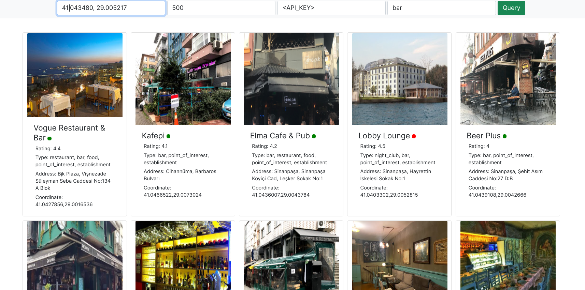

# Used Tecnologies
Spring Boot, Java 11, Maven, React.js

# Application Purpose
You can see nearby places to given coordinate. Feed Google Places API. 

# Requirements

Backend Requirements

* JDK 11 http://jdk.java.net/java-se-ri/11 (OpenJDK)
* Maven https://maven.apache.org/download.cgi

Frontend Ruquirements:

* Node.js https://nodejs.org/en/download/

    
You can find requirements setup instructions below.

# Build And Run Application

## 1. Use Wrappers (Fastest Method)
* Easiest way run the spring application. Used maven wrapper for run the app for this way.(wrapper: mvnw or mvnw.cmd)

    * Get application source code with Git. (You should have git program for run this command or you can just download source code from browser)

        Use commands in order:

            $ git clone https://github.com/erensayar/FindPlacesInSpecificAreaOnMap.git
            $ cd FindPlacesInSpecificAreaOnMap
            $ mvn spring-boot:run

## 2. Packaging (Different Way)
* Get application source code with Git. (You should have git program for run this command or you can just download source code from browser)

        $ git clone https://github.com/erensayar/FindPlacesInSpecificAreaOnMap.git
        $ cd FindPlacesInSpecificAreaOnMap

* Compilation and build with maven.
    
        $ mvn package
    
* Now we have a jar file.

        java -jar <jarFileName>.jar
        


# API

* EndPoint:

    {{base-url}}/api/v1/query/google-places?location=<LATITUDE>,<LONGITUDE>&radius=<RADIUS>&type=<PLACE_TYPE>&key=<API_KEY>

* Response Sample: 

    ```
    {
        "id": 33,
        "name": "Hede Hödö Place",
        "coordinate": "41.00000,28.00000",
        "isOpen": "false",
        "rating": 4.5,
        "photoReference": "Aap_uEC8Q3F0HMoy0nYsHGuajDoiNxHhiUkNoW70p3eO1NASjeP0",
        "address": "Galata Kulesi Sokak",
        "type": "bar, point_of_interest, establishment"
    }
    ```

# Default Application Configurations

* Server Port : <b>8070</b>
* Swagger Directory : /swagger-ui.html
* H2 Console Directory : /h2-console/login
* H2 Console Configurations:
    * User Name: sa
    * Datasource.url: <b>jdbc:h2:find-places</b>

# Front End Screen Shot



# Requirements Setup For GNU/Linux:


1.You can use package manager:

Java:

    $ sudo apt-get update \
    && sudo apt-get install openjdk-11-jdk \
    && java -version

Maven:

    $ sudo apt install maven \
    && mvn -version

2.Manuel Setup:

* Get JDK And Maven compressed files.

* Then extract.

* Give name without space to files. (Java File: OpenJDK-11 | Maven: Maven)

* Then move files to any where permanently.

* Last thing you should set PATH and ENVIRONMENT VARIABLE:

    * Open terminal and open .bashrc file with any editor for edit this file. (I choose gedit for this example)

            $ gedit .bashrc

    * And then add this lines.        


    Maven:

        export M2_HOME=/${PATH}/${MAVEN-MAIN-DIRECTORY}
        export PATH=$M2_HOME/bin:$PATH

    Java:        

        export JAVA_HOME=/${PATH}/${JAVA-MAIN-DIRECTORY}
        export PATH=$JAVA_HOME/bin:$PATH